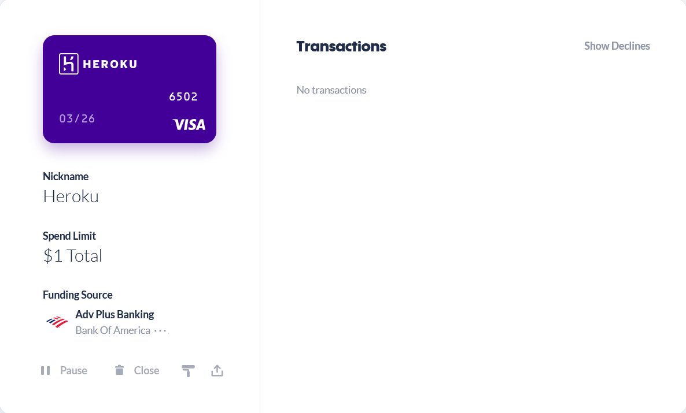
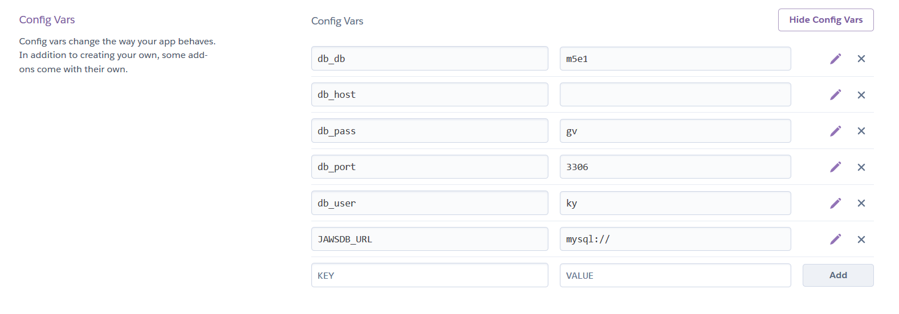

# MySQL with Heroku

Publishing this app the heroku is a tough assignment. Heroku will ask for your credit card information in order to access their recources. In this tutorial I will show you how to setup your repository and heroku settings

## Table of Contents
* [Setup your repository](#Setup%20your%20repository)
* [Setup your system variables](#Setup%20your%20system%20variables)
* [Setup your heroku app](#Setup%20your%heroku%app)
* [Helpful Tool](#Helpful%20Tool)
* [Last Setup](#last%20setup) 
#
* [Credits](#Credits)
* [Contributing](#Contributing)
* [License](#License)
# Setup your repository
In your *connection.js* you will need to setup some *system variables*.

    // Set up MySQL connection.
    var mysql =  require("mysql");
    
    var connection = mysql.createConnection({
    host: process.env.db_host || "localhost",
    port: process.env.db_port || "3306",
    user: process.env.db_user || "root",
    password: process.env.db_pass,
    database: process.env.db_db ||  "burgers_db"
    });
    // Make connection.
    connection.connect();
    module.exports  = connection;

## Setup your system variables
Type this in your git bash in order for Node.JS to read your variables 

    export db_host='localhost' #Optional
    export db_port='3306' #Optional
    export db_user='root' #Optional
    export db_pass='root' 

Now when you start your server, everything should work fine. Make sure to save you changes by commiting `git add -A` ,`git commit -m 'Updated database settings'`and finally pushing to github `git push`
## Setup your heruko app

 1. In your git bash do ``heroku create`` . 
 2. Now head on over to https://dashboard.heroku.com/apps/ to setup your MySQL database
 3. Go to the app you just setup and got the the `recources tab`
 4. Look for the Add-Ons section in your app’s dashboard and type JawsDB in the
    input field. That should bring up the JawsDB MySQL add-on.
Follow this [PDF](MySQLHerokuDeployment.pdf) tutorial for the rest of the instructions.
## Helpful tool
There's a website called [privacy.com](https://privacy.com/join/V8RHK) which allows you to get a dummy credit card. It will protect you from getting unnecessary charges

## Last setup
Now that mostly everything is setup it is now time to add those variables to your heroku app settings and find `Config Vars`

Finally, upload your repository with `git push heroku`

Hopefully you found this tutorial helpful, if you have any questions let me know @ main@dvasquez4155.com
## Credits
[ Daniel Vasquez Talavera](https://github.com/DVasquez4155)
## Contributing
This project has adopted the code of conduct defined by [Contributor Covenant](https://www.contributor-covenant.org/version/2/0/code_of_conduct/).
## License
Licensed under the [MIT License](https://choosealicense.com/licenses/mit/) license.
